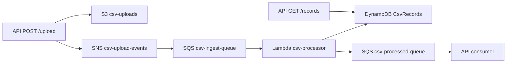

# Plano: CSV Parse Na Lambda

## Objetivo

Trocar o parser manual da Lambda por `csv-parse`, usando o modelo em stream como implementação principal para estudo de uma abordagem mais próxima de produção.



## Mudanças Previstas

- Adicionar `csv-parse` nas dependências da Lambda em [`lambda/package.json`](lambda/package.json).
- Atualizar [`lambda/src/handler.js`](lambda/src/handler.js) para importar `parse` de `csv-parse` e `csv-parse/sync`.
- Remover o parser manual baseado em `split`.
- Criar duas funções didáticas:
  - `parseCsvStream(readableStream)`: implementação usada no fluxo principal.
  - `parseCsvSync(content)`: implementação alternativa, sem uso por enquanto, para comparar com a abordagem sync.
- Manter a validação do header esperado: `nome,data,valor`.
- Manter logs estruturados com `correlationId`.
- Preservar o comportamento de erro atual: erro no CSV deve lançar exceção para permitir retry via SQS.

## Abordagem Recomendada

A Lambda deve continuar baixando o arquivo com `GetObjectCommand`, mas passar o `object.Body` diretamente para o parser em stream:

```js
const object = await s3.send(new GetObjectCommand({ Bucket: bucket, Key: key }));
const rows = await parseCsvStream(object.Body);
```

A função `parseCsvStream` deve usar `csv-parse` com opções seguras e explícitas:

- `columns: true`, para transformar cada linha em objeto usando o header.
- `skip_empty_lines: true`, para ignorar linhas vazias.
- `trim: true`, para limpar espaços em torno dos campos.
- `bom: true`, para lidar melhor com CSVs salvos com BOM.
- `relax_column_count: false`, para falhar quando uma linha tiver quantidade de colunas diferente do header.

Depois do parse, validar as colunas para garantir que o CSV contém exatamente `nome`, `data`, `valor`.

## Comentários Didáticos No Código

Adicionar comentários curtos explicando:

- Por que `GetObjectCommand` retorna `Body` como stream no AWS SDK v3.
- Por que stream é preferível para arquivos maiores: evita carregar o arquivo inteiro em memória.
- Por que ainda existe `parseCsvSync`: referência didática para arquivos pequenos, não usada no fluxo principal.
- Por que erros de parsing devem ser lançados: a Lambda falha e o SQS pode tentar novamente.

Evitar comentários óbvios linha a linha. A ideia é explicar decisões técnicas, não repetir o que o código já mostra.

## Validação LocalStack

Após implementar:

- Instalar dependências da Lambda:
  ```bash
  cd lambda && npm install csv-parse
  ```

- Derrubar a stack atual:
  ```bash
  scripts/destroy-cfn.sh
  ```

- Remontar o ambiente via CloudFormation:
  ```bash
  scripts/deploy-cfn.sh
  ```

- Atualizar o `api/.env` com os outputs exibidos pelo deploy, se necessário.

- Subir a API:
  ```bash
  cd api && npm run start:dev
  ```

- Enviar o arquivo [`arquivo.csv`](arquivo.csv) para o endpoint de upload:
  ```bash
  curl -F "file=@arquivo.csv" http://localhost:3000/upload
  ```

- Confirmar que os registros foram salvos consultando:
  ```bash
  curl http://localhost:3000/records
  ```

## Revisão De Documentação

Depois que os testes passarem, revisar os arquivos em [`docs/`](docs/) para verificar se algo ficou desatualizado.

Atualizar somente se necessário, por exemplo:

- Mudança no comportamento da Lambda ao processar CSV.
- Mudança em comandos de deploy, reset do LocalStack ou validação.
- Mudança no fluxo documentado de upload, Lambda, DynamoDB ou consulta por `GET /records`.
- Observações relevantes sobre o uso de `csv-parse` em stream.

Não alterar documentação apenas por refatoração interna que não afete o entendimento do fluxo.

## Critérios De Sucesso

- O upload retorna `s3Key` e `messageId`.
- A Lambda usa `parseCsvStream` no fluxo principal.
- A função `parseCsvSync` existe apenas como referência de estudo.
- A Lambda processa o CSV sem erro nos logs.
- Os itens aparecem na tabela `CsvRecords`.
- `GET /records` retorna os registros de `arquivo.csv`.
- Os logs mantêm o mesmo `correlationId` entre API, Lambda e consumer.
- A documentação em `docs/` foi revisada e atualizada apenas se houve impacto real.

## Observações

- Não é necessário criar testes unitários ou documentação adicional para essa mudança.
- A mudança principal deve ficar restrita à Lambda.
- Se durante a validação aparecer falha de contrato no `correlationId`, ajustar apenas o necessário para manter rastreabilidade ponta a ponta.
