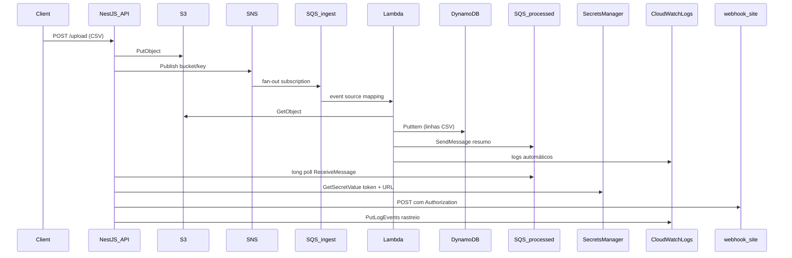
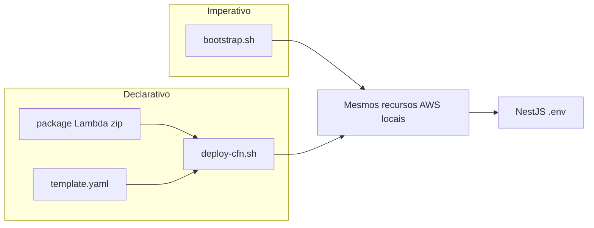

# Plano: pipeline CSV com LocalStack (estudo)

## Viabilidade no seu ambiente

Verifiquei o container `localstack-main` (porta **4566**, healthy). Todos os serviços pedidos estão **available**: `s3`, `sns`, `sqs`, `lambda`, `dynamodb`, `secretsmanager`, `iam`, `logs`, `cloudwatch`.

| Serviço | Plano Hobby | Observação |
|---------|-------------|------------|
| S3, SNS, SQS, Lambda, DynamoDB, Secrets Manager, CloudWatch Logs/Metrics | Sim | Fluxo principal viável |
| IAM (políticas/roles reais) | Parcial | Criamos roles/policies para **estudo**; o LocalStack **não nega** chamadas como na AWS real na maioria dos casos |
| **CloudFormation** | **Sim (Hobby)** | Disponível no seu health (`cloudformation: available`); ver seção abaixo |
| Persistência | Desabilitada no seu stack | Ao reiniciar o container, recursos somem — `bootstrap.sh` ou `deploy-cfn.sh` recriam tudo |
| Auth token LocalStack | Pode ser obrigatório em versões novas | Se `bootstrap` falhar por auth, configurar `LOCALSTACK_AUTH_TOKEN` no container (conta gratuita Hobby) |

**Nada precisa ser removido do fluxo** no free tier. A única simplificação recomendada é **não** usar S3 Event Notifications (mais frágil localmente) e disparar SNS manualmente após o upload — você ainda usa S3 + SNS + SQS.

Scripts e testes usam **`awslocal`** contra `http://127.0.0.1:4566`, região **`us-east-1`**, credenciais `test`/`test`.

---

## Referência CLI (ajuda local)

Antes de implementar `bootstrap.sh`, depurar filas/Lambda ou validar recursos manualmente, use **[`docs/CLI-LOCALSTACK.md`](docs/CLI-LOCALSTACK.md)** como arquivo de ajuda:

- **O que contém:** resultados reais de testes `awslocal` por serviço (S3, SNS, SQS, DynamoDB, Secrets Manager, IAM, CloudWatch Logs, Lambda, CloudFormation) no mesmo ambiente (WSL2 + LocalStack em `4566`).
- **Quando consultar:** ao escrever comandos no bootstrap/destroy, ao conferir health, ao investigar falhas (SNS→SQS vazio, Lambda em `Pending`, formato de `put-log-events`, deploy CFN) ou ao montar curls/scans de verificação no E2E.
- **Relação com este plano:** os recursos aqui usam prefixos/nomes de produção do estudo (`csv-*`, `study/*`); o doc de CLI usou prefixo `cli-test-*` só para experimentos — os **comandos e padrões** (subscribe SNS→SQS, zip da Lambda, wait antes do invoke, divergências LocalStack vs AWS) aplicam-se igualmente.

Não duplicar troubleshooting de CLI no README: apontar para `docs/CLI-LOCALSTACK.md` e manter no README apenas variáveis, endpoints da API e fluxo do projeto.

---

## Arquitetura do fluxo



**CSV modelo** ([`arquivo.csv`](arquivo.csv)): colunas `nome`, `data`, `valor` — a Lambda valida header e grava cada linha no DynamoDB.

---

## Estrutura de pastas (tudo em [`/home/ruy/estudos/upload-files`](file:///home/ruy/estudos/upload-files))

```
upload-files/
├── arquivo.csv                 # exemplo existente
├── infrastructure/
│   ├── template.yaml           # stack CloudFormation (comentado)
│   └── parameters.example.json # webhook URL/token como parâmetros
├── scripts/
│   ├── bootstrap.sh            # provisionamento imperativo (CLI, passo a passo)
│   ├── destroy.sh              # remove recursos criados pelo bootstrap
│   ├── deploy-cfn.sh           # empacota Lambda, faz deploy da stack CFN
│   └── destroy-cfn.sh          # delete-stack CloudFormation
├── lambda/
│   ├── src/handler.js          # processamento CSV (JS, comentado)
│   ├── package.json
│   └── dist/function.zip       # gerado no bootstrap
├── api/
│   ├── src/main.ts
│   ├── src/upload/upload.controller.ts
│   ├── src/upload/upload.service.ts
│   ├── src/aws/aws.config.ts   # factory SDK com endpoint
│   ├── src/consumer/processed-queue.consumer.ts
│   ├── src/webhook/webhook.service.ts
│   └── .env.example
├── docs/
│   ├── CLI-LOCALSTACK.md       # ajuda: awslocal, serviços locais, sucessos/falhas (já existente)
│   └── ARQUITETURA.md          # criado após testes end-to-end
└── README.md                   # como subir API + rodar bootstrap + testar
```

---

## Endpoints e rede (WSL2 + Docker)

| Quem roda | Onde | `AWS_ENDPOINT_URL` / endpoint SDK |
|-----------|------|-----------------------------------|
| NestJS (host WSL) | Fora do Docker | `http://127.0.0.1:4566` |
| Lambda (container filho do LocalStack) | Rede Docker | `http://localstack-main:4566` (nome do seu container) |
| S3 path-style (ambos) | — | `forcePathStyle: true` |

Credenciais padrão LocalStack em todo lugar: `AWS_ACCESS_KEY_ID=test`, `AWS_SECRET_ACCESS_KEY=test`, região fixa **`us-east-1`** (evita mismatch de ARN entre SQS e Lambda, problema comum no LocalStack).

**Webhook:** apenas a API NestJS chama `https://webhook.site/...` (internet a partir do WSL). A Lambda **não** precisa sair para a internet — mais estável no Docker.

---

## Provisionamento (`scripts/bootstrap.sh`)

Script idempotente (comentado linha a linha) usando `awslocal`. Para exemplos de comando por serviço e armadilhas já vistas no ambiente local, ver [`docs/CLI-LOCALSTACK.md`](docs/CLI-LOCALSTACK.md).

1. **S3** — bucket `csv-uploads`
2. **SNS** — tópico `csv-upload-events`
3. **SQS** — filas `csv-ingest-queue` e `csv-processed-queue`
4. **SNS → SQS** — subscription do tópico na fila de ingestão (raw message delivery)
5. **DynamoDB** — tabela `CsvRecords` (PK `id` string; atributos `nome`, `data`, `valor`, `sourceKey`, `uploadedAt`)
6. **Secrets Manager** — secret `study/webhook` com JSON:
   ```json
   { "token": "token-estudo", "webhookUrl": "https://webhook.site/SEU-UUID" }
   ```
   Você troca a URL pelo UUID real do [webhook.site](https://webhook.site) antes do teste final.
7. **IAM** (estudo):
   - Role `csv-processor-lambda-role` com policy inline: `s3:GetObject`, `dynamodb:PutItem`, `sqs:SendMessage`, `logs:*` no bucket/tabela/filas criados
8. **Lambda** (`csv-processor`, runtime `nodejs18.x`):
   - Zip com `handler.js` + dependência mínima se necessário
   - Variáveis: `S3_ENDPOINT`, `DYNAMODB_TABLE`, `PROCESSED_QUEUE_URL`, `AWS_REGION`
   - `create-event-source-mapping` — fila ingest → Lambda
9. **CloudWatch Logs** — log group `/study/csv-pipeline` (API escreve aqui também)

Ao final, o script imprime URLs/ARNs para colar no [`.env`](api/.env.example) da API.

---

## Provisionamento declarativo (CloudFormation)

**Objetivo de estudo:** comparar o mesmo ambiente criado de duas formas — shell imperativo vs template declarativo.

### Viabilidade no LocalStack Free

- **CloudFormation está no plano Hobby** e já aparece como `available` no seu container.
- Template em **YAML puro**, sem SAM/CDK transforms (evita dependências extras e falhas locais).
- Cobertura de APIs no LocalStack é boa para S3, SNS, SQS, DynamoDB, IAM, Lambda, Secrets Manager e Log Groups; alguns detalhes podem divergir da AWS real (documentar no README se ocorrer).

### Conteúdo de [`infrastructure/template.yaml`](infrastructure/template.yaml)

Recursos espelhando o bootstrap (nomes lógicos com `AWS::StackName` onde fizer sentido):

| Recurso CFN | Equivalente bootstrap |
|-------------|----------------------|
| `AWS::S3::Bucket` | `csv-uploads` |
| `AWS::SNS::Topic` | `csv-upload-events` |
| `AWS::SQS::Queue` (×2) | `csv-ingest-queue`, `csv-processed-queue` |
| `AWS::SNS::Subscription` | SNS → SQS ingest |
| `AWS::DynamoDB::Table` | `CsvRecords` |
| `AWS::SecretsManager::Secret` | `study/webhook` (valores via parâmetros) |
| `AWS::IAM::Role` + `AWS::IAM::Policy` | role da Lambda com S3/DynamoDB/SQS/Logs |
| `AWS::Logs::LogGroup` | `/study/csv-pipeline` |
| `AWS::Lambda::Function` | `csv-processor` |
| `AWS::Lambda::EventSourceMapping` | fila ingest → Lambda |

**Outputs exportados** (para `.env` da API): `BucketName`, `IngestQueueUrl`, `ProcessedQueueUrl`, `SnsTopicArn`, `DynamoTableName`, `SecretArn`, `LogGroupName`.

### Lambda + CloudFormation (padrão híbrido mínimo)

O código da Lambda **não** fica inline no template (difícil de manter). Fluxo do [`scripts/deploy-cfn.sh`](scripts/deploy-cfn.sh):

1. `npm run package` em `lambda/` → gera `lambda/dist/function.zip`
2. Cria bucket temporário de deploy `csv-cfn-artifacts` (se não existir)
3. `aws s3 cp` do zip para `s3://csv-cfn-artifacts/csv-processor.zip`
4. `awslocal cloudformation deploy` com parâmetros:
   - `LambdaS3Bucket`, `LambdaS3Key`
   - `WebhookUrl`, `WebhookToken` (secret)
5. Aguarda `CREATE_COMPLETE` / `UPDATE_COMPLETE` e imprime **Outputs** no terminal

Parâmetros opcionais em [`infrastructure/parameters.example.json`](infrastructure/parameters.example.json) para `deploy --parameter-overrides file://...`.

### Dois caminhos de provisionamento (escolha do estudante)



**Importante:** não rodar **bootstrap** e **deploy-cfn** ao mesmo tempo com os mesmos nomes fixos — escolher **um** método por ciclo de teste, ou usar `destroy` / `delete-stack` antes de trocar. O README explicará isso claramente.

### Limitações conhecidas (CFN no LocalStack)

- **Sem nested stacks** nem SAM — template único e simples.
- **Update de código Lambda:** novo zip no S3 + `cloudformation deploy` (ou `aws lambda update-function-code` documentado como atalho).
- **Secrets Manager:** `SecretString` via parâmetro CFN funciona; rotação automática não é foco do estudo.
- Se `deploy` falhar em algum recurso exótico, consultar [`docs/CLI-LOCALSTACK.md`](docs/CLI-LOCALSTACK.md) (seção CloudFormation e Falhas); o README terá fallback: “use `bootstrap.sh`” ou ajuste manual — sem remover CFN do projeto.

### Testes CFN (adicional ao plano de E2E)

1. `scripts/destroy.sh` (se rodou bootstrap antes)
2. `scripts/deploy-cfn.sh`
3. Conferir stack: `awslocal cloudformation describe-stacks --stack-name csv-pipeline-study`
4. Mesmo fluxo de upload curl + validações DynamoDB/webhook/logs
5. `scripts/destroy-cfn.sh` para limpar

---

## API NestJS (simples e comentada)

- **POST `/upload`** — `multipart/form-data` campo `file`; valida `.csv`; envia para `s3://csv-uploads/uploads/{timestamp}-{nome}.csv`; publica no SNS payload `{ bucket, key, uploadedAt }`; retorna `{ s3Key, messageId }`.
- **Consumer em background** (`OnModuleInit`) — loop com `ReceiveMessage` + `DeleteMessage` na fila `csv-processed-queue`; para cada mensagem:
  - lê secret `study/webhook`
  - `POST` no `webhookUrl` com header `Authorization: Bearer {token}` e body JSON (resumo do processamento + ids DynamoDB)
  - `PutLogEvents` em `/study/csv-pipeline` com correlationId
- SDK v3 (`@aws-sdk/client-s3`, `sns`, `sqs`, `secrets-manager`, `cloudwatch-logs`)
- Porta **3000**; CORS liberado para testes com browser/curl

---

## Lambda JavaScript (`lambda/src/handler.js`)

Para cada mensagem SQS (vinda do SNS, body JSON com `bucket`/`key`):

1. `GetObject` no S3
2. Parse CSV (linhas; ignora header `nome,data,valor`)
3. `PutItem` no DynamoDB por linha (UUID como `id`)
4. `SendMessage` na `csv-processed-queue` com `{ sourceKey, recordsCount, recordIds, processedAt }`
5. Logs em `console.log` → CloudWatch Logs automático da Lambda (`/aws/lambda/csv-processor`)

Tratamento de erro simples: log + throw para SQS retry (comentado no código).

---

## CloudWatch (rastreio)

- **Lambda:** logs automáticos em `/aws/lambda/csv-processor`
- **API:** helper que envia eventos estruturados (`upload_started`, `sns_published`, `webhook_sent`, `webhook_failed`) para `/study/csv-pipeline`
- **Consulta local:** `awslocal logs filter-log-events --log-group-name /study/csv-pipeline` (ver também exemplos em [`docs/CLI-LOCALSTACK.md`](docs/CLI-LOCALSTACK.md))

Métricas custom (`PutMetricData`) ficam como **opcional** — Logs já cobrem o objetivo de estudo sem complexidade extra.

---

## Testes planejados (após implementação)

**Caminho A — bootstrap (imperativo)**

1. Rodar `scripts/bootstrap.sh`

**Caminho B — CloudFormation (declarativo)**

1. Rodar `scripts/deploy-cfn.sh` (com `WebhookUrl` do webhook.site nos parâmetros)

**Comum aos dois caminhos**

2. Preencher `.env` da API com Outputs do script escolhido (ou secret já parametrizado no CFN)
3. `npm run start:dev` na API
4. Upload: `curl -F "file=@arquivo.csv" http://localhost:3000/upload`
5. Verificar (comandos alinhados ao guia [`docs/CLI-LOCALSTACK.md`](docs/CLI-LOCALSTACK.md)):
   - objeto no S3 (`awslocal s3 ls s3://csv-uploads/uploads/`)
   - itens no DynamoDB (`awslocal dynamodb scan --table-name CsvRecords`)
   - mensagem na fila processada (consumer da API)
   - request no painel webhook.site
   - logs (`awslocal logs tail /aws/lambda/csv-processor` e `/study/csv-pipeline`)
6. Opcional: testar upload via browser (form HTML mínimo no README ou Thunder Client)

Se algo falhar na Lambda (rede), ajustar `AWS_ENDPOINT_URL` para `http://172.17.0.1:4566` (gateway Docker) como fallback documentado no README.

---

## Documentação final

| Arquivo | Papel |
|---------|--------|
| [`docs/CLI-LOCALSTACK.md`](docs/CLI-LOCALSTACK.md) | **Já existe** — referência de ajuda para CLI/`awslocal` e comportamento dos serviços no LocalStack (comandos, erros comuns, divergências vs AWS). |
| [`docs/ARQUITETURA.md`](docs/ARQUITETURA.md) | Criar após E2E — fluxo do projeto CSV, bootstrap vs CFN, recursos `csv-*` / `study/*`, variáveis da API. |

Após o fluxo passar, criar [`docs/ARQUITETURA.md`](docs/ARQUITETURA.md) com:

- diagrama do fluxo (mermaid)
- comparação **bootstrap vs CloudFormation** (quando usar cada um)
- tabela de recursos AWS locais (nomes, ARNs, Outputs da stack)
- variáveis de ambiente
- comandos de teste do pipeline (troubleshooting de **aplicação**); para CLI genérica, linkar [`docs/CLI-LOCALSTACK.md`](docs/CLI-LOCALSTACK.md)
- limitações do plano Hobby vs AWS real (incl. CFN) — resumo aqui; detalhes de CLI no doc de referência

---

## O que **não** faremos (escopo controlado)

- Terraform / CDK / SAM (só CloudFormation YAML + shell)
- Nested stacks ou múltiplas stacks CFN
- Testes unitários (regra sua)
- S3 Event Notification (substituído por SNS explícito da API — mesmo aprendizado, menos dor no LocalStack)
- Autenticação na API (foco em AWS)
