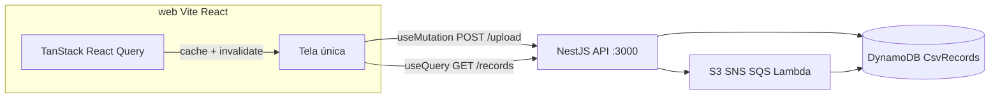

# Plano: Frontend + GET DynamoDB + testes Browser

## Contexto atual

- API em [`api/`](api/) expõe apenas `POST /upload` ([`upload.controller.ts`](api/src/upload/upload.controller.ts)).
- CORS já está global em [`main.ts`](api/src/main.ts) — frontend em outra porta (5173) funcionará sem mudança extra.
- DynamoDB `CsvRecords` é populada pela Lambda com campos: `id`, `nome`, `data`, `valor`, `sourceKey`, `uploadedAt` ([`handler.js`](lambda/src/handler.js)).
- [`aws.config.ts`](api/src/aws/aws.config.ts) **não** inclui cliente DynamoDB — precisa ser adicionado junto com `DYNAMODB_TABLE` no config.



---

## Fase 1 — Endpoint GET na API

*(Inalterada em relação à versão anterior.)*

### 1.1 Dependências e cliente AWS

- Instalar em [`api/package.json`](api/package.json):
  - `@aws-sdk/client-dynamodb`
  - `@aws-sdk/lib-dynamodb`
- Estender [`AwsClients`](api/src/aws/aws.config.ts):
  - `dynamo: DynamoDBDocumentClient`
  - `config.dynamodbTable: string` (de `DYNAMODB_TABLE`, default `CsvRecords`)

### 1.2 Módulo `records`

Criar módulo NestJS seguindo o padrão de [`upload/`](api/src/upload/):

| Arquivo | Responsabilidade |
|---------|------------------|
| `api/src/records/records.module.ts` | Módulo |
| `api/src/records/records.controller.ts` | `GET /records` |
| `api/src/records/records.service.ts` | `ScanCommand` no DynamoDB |

**Contrato do endpoint:**

```
GET /records?limit=100
```

Resposta:

```json
{
  "items": [
    { "id": "...", "nome": "...", "data": "...", "valor": "...", "sourceKey": "...", "uploadedAt": "..." }
  ],
  "count": 2
}
```

- Usar `ScanCommand` via `@aws-sdk/lib-dynamodb` (suficiente para estudo; tabela pequena).
- Query param opcional `limit` (default 100, cap 500) via `Limit` no scan.
- Ordenar no service por `uploadedAt` desc (pós-scan, em memória).
- Registrar `RecordsModule` em [`app.module.ts`](api/src/app.module.ts).

---

## Fase 2 — Frontend Vite + TypeScript + shadcn (tela única)

### 2.1 Scaffold em `web/`

Nova pasta na raiz do repo (paralela a `api/`):

```bash
npm create vite@latest web -- --template react-ts
cd web && npx shadcn@latest init
```

Configuração sugerida:
- **Style:** New York · **Base color:** Zinc · **CSS variables:** sim
- Tailwind v4 ou v3 conforme CLI do shadcn (seguir defaults do init)

### 2.2 Dependências adicionais

- **`@tanstack/react-query`** — cache, loading/error states e invalidação após upload
- **Sem `react-router-dom`** — uma única tela, sem rotas
- Componentes shadcn: `button`, `input`, `table`, `card`, `alert`, `badge`, `skeleton`

### 2.3 Estrutura de pastas

```
web/
├── src/
│   ├── main.tsx                # QueryClientProvider
│   ├── App.tsx                 # Tela única (Dashboard)
│   ├── lib/
│   │   ├── api.ts              # fetchRecords, uploadCsv
│   │   └── query-client.ts     # QueryClient config
│   ├── hooks/
│   │   ├── useRecords.ts       # useQuery(['records'])
│   │   └── useUploadCsv.ts     # useMutation + invalidate
│   ├── types/record.ts
│   └── components/
│       ├── UploadSection.tsx   # input file + botão enviar + feedback
│       └── RecordsTable.tsx    # tabela shadcn + badge count
├── .env.example
└── vite.config.ts
```

### 2.4 Tela única — layout e comportamento

Uma página (`App.tsx` ou `DashboardPage.tsx`) com duas seções empilhadas:

**Seção superior — Upload**
- Card com input `accept=".csv"` e botão “Enviar”.
- `useMutation` → `POST ${VITE_API_URL}/upload`.
- Alert de sucesso (`s3Key`) ou erro.

**Seção inferior — Registros**
- Card com título + badge `count` (via `data.count` do query).
- `RecordsTable` alimentada por `useQuery`.
- Botão “Atualizar” chama `refetch()` manualmente.

### 2.5 React Query — cache e refresh pós-upload

Configuração sugerida em `query-client.ts`:

```ts
staleTime: 30_000        // cache fresco por 30s
refetchOnWindowFocus: true
```

**Query de listagem** (`useRecords`):

```ts
useQuery({
  queryKey: ['records'],
  queryFn: () => fetchRecords(),
})
```

**Mutation de upload** (`useUploadCsv`):

```ts
useMutation({
  mutationFn: uploadCsv,
  onSuccess: () => {
    // Invalida cache → refetch automático da tabela
    queryClient.invalidateQueries({ queryKey: ['records'] })
  },
})
```

**Polling após upload** (Lambda é assíncrona — registros demoram alguns segundos):

No `onSuccess` da mutation, além de `invalidateQueries`, iniciar **refetch interval temporário**:

```ts
// Após upload bem-sucedido: poll a cada 2s por até 30s
queryClient.refetchQueries({ queryKey: ['records'] })
const interval = setInterval(() => {
  queryClient.refetchQueries({ queryKey: ['records'] })
}, 2000)
setTimeout(() => clearInterval(interval), 30_000)
```

Alternativa mais idiomática: `refetchInterval` dinâmico no `useQuery` — ativar polling por 30s quando `isUploadPending || justUploaded` (flag local). Escolher a abordagem mais simples na implementação.

Estados na UI:
- Tabela: `isLoading` → Skeleton; `isFetching && !isLoading` → indicador sutil “Atualizando…”
- Upload: `isPending` desabilita botão

### 2.6 Variáveis de ambiente

[`web/.env.example`](web/.env.example):

```
VITE_API_URL=http://localhost:3000
```

---

## Fase 3 — Documentação mínima

Atualizar [`README.md`](README.md) com seção **Frontend**:

1. `cd web && npm install && cp .env.example .env`
2. Subir API + LocalStack provisionado
3. `npm run dev` → http://localhost:5173 (tela única: upload + tabela)

Sem testes unitários (regra do projeto).

---

## Fase 4 — Testes E2E com Browser MCP

### Pré-requisitos (subir antes dos testes)

1. LocalStack healthy + recursos provisionados (`bootstrap.sh` ou `deploy-cfn.sh`)
2. API: `cd api && npm run start:dev` (porta 3000)
3. Frontend: `cd web && npm run dev` (porta 5173)

### Roteiro de teste Browser (tela única)

| Passo | Ação MCP | Validação |
|-------|----------|-----------|
| 1 | `browser_navigate` → `http://localhost:5173` | Upload + tabela visíveis na mesma página |
| 2 | `browser_snapshot` | Seção upload e tabela (ou estado vazio) presentes |
| 3 | Upload do [`arquivo.csv`](arquivo.csv) via input file | — |
| 4 | Clicar enviar, `browser_snapshot` | Alert de sucesso com `s3Key` |
| 5 | Aguardar ~10–15s (polling React Query + Lambda) | — |
| 6 | `browser_snapshot` novamente | Tabela com ≥2 linhas (`produto A`) sem navegar |
| 7 | `browser_take_screenshot` | Evidência visual |

Opcional: clicar “Atualizar” e confirmar que `refetch` funciona.

### Tratamento se Browser falhar

Se `browser_navigate` ou snapshot retornarem erro de conexão (comum quando MCP não alcança `localhost` do WSL):

1. **Parar** e reportar ao usuário: mensagem de erro exata + URL tentada.
2. **Pedir ajuda** para:
   - Confirmar se API e frontend estão rodando (`curl localhost:3000/records`, `curl localhost:5173`)
   - Informar URL alternativa acessível ao Browser (ex.: IP WSL, port forwarding)
3. Retomar testes após confirmação do usuário.

Não improvisar workarounds sem evidência; seguir instruções do MCP Browser (lock → interações → unlock).

---

## Ordem de implementação

1. API: DynamoDB client + `GET /records`
2. Frontend: scaffold + shadcn + React Query + tela única
3. README
4. Subir serviços e executar roteiro Browser
5. Ajustes finos se upload/listagem falharem (timing do poll, CORS, URL)

## Riscos e mitigações

| Risco | Mitigação |
|-------|-----------|
| Tabela vazia logo após upload | `invalidateQueries` + polling 2s/30s via React Query |
| Browser não acessa localhost | Escalar para o usuário conforme Fase 4 |
| shadcn init interativo | Usar flags não-interativas do CLI ou defaults documentados |
| Cache stale após upload | `invalidateQueries` no `onSuccess` da mutation |
