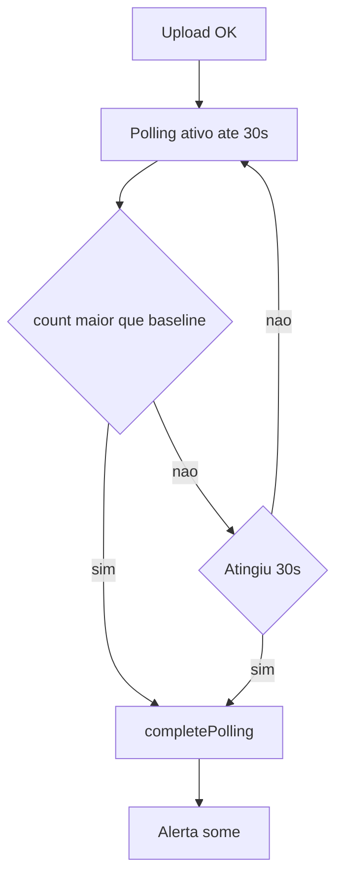

# Plano: Melhorias de polling no frontend

Salvar/copiar para: [`.cursor/plans/frontend_polling_melhorias.plan.md`](.cursor/plans/frontend_polling_melhorias.plan.md)

**Executar com agente:** *"Implement the plan frontend_polling_melhorias"*

## Regra de polling

| Parâmetro | Valor |
|-----------|--------|
| Intervalo | 2s (`refetchInterval` em `useRecords`) |
| **Duração máxima** | **30s** — mantém o timer fixo como teto |
| **Encerramento antecipado** | Se `data.count > baselineCount`, `completePolling()` **antes** dos 30s |
| Ao encerrar | Para polling + cancela timer + `mutation.reset()` (some alerta verde) |

**Não substitui os 30s** — só encerra mais cedo quando a tabela já atualizou.



Arquivos: [`web/src/hooks/useUploadCsv.ts`](web/src/hooks/useUploadCsv.ts), [`web/src/App.tsx`](web/src/App.tsx).

---

## Fase 1 — `useUploadCsv.ts`

- `POLLING_DURATION_MS = 30_000` (inalterado)
- `baselineCount` ao iniciar polling
- `completePolling()` = stop polling + clear timeout + `mutation.reset()`
- `startPolling()` = set baseline + invalidate + **`setTimeout(completePolling, 30_000)`**
- `mutateWithPolling` com `startPolling` no `onSuccess`

---

## Fase 2 — `App.tsx`

```tsx
useEffect(() => {
  if (!upload.polling || data === undefined) return;
  if (data.count > upload.baselineCount) {
    completePollingRef.current();
  }
}, [upload.polling, upload.baselineCount, data?.count, data]);
```

---

## Verificação

- **Cedo:** upload → count sobe em ~5–15s → polling para + alerta some
- **Teto:** sem novos dados → para aos 30s + alerta some
- `cd web && npm run build`
