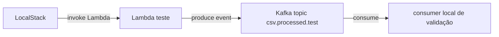

# Plano: Spike Kafka com LocalStack

## Objetivo

Criar uma prova de conceito isolada para validar a comunicação entre LocalStack, Lambda e Kafka local antes de alterar o pipeline principal. O foco é responder se a Lambda consegue publicar o resumo processado em um broker Kafka dentro do ambiente Docker local, quais endpoints funcionam e quais cuidados de rede/configuração precisam ser documentados.

## Escopo

Este plano não altera o fluxo principal de produção local. Ele cria um experimento controlado para testar conectividade, publicação e consumo de mensagens Kafka a partir de uma Lambda no LocalStack.

Arquivos e áreas a observar:

- [docs/ARQUITETURA.md](docs/ARQUITETURA.md), para comparar o fluxo atual com a hipótese Kafka.
- [docs/CLI-LOCALSTACK.md](docs/CLI-LOCALSTACK.md), para registrar resultados e divergências locais.
- [scripts/bootstrap.sh](scripts/bootstrap.sh), para entender como a Lambda atual recebe env vars e endpoints.
- [lambda/src/handler.js](lambda/src/handler.js), como referência do ponto atual onde a mensagem é enviada para `csv-processed-queue`.
- Novo `docker-compose.yml` ou compose específico de estudo, se o experimento for implementado.

## Fluxo Do Experimento



## Estratégia

1. Definir um Docker Compose mínimo com LocalStack e Kafka local. Para simplicidade de estudo, considerar Redpanda como broker Kafka-compatible, pois evita ZooKeeper e reduz configuração.

2. Garantir que LocalStack e Kafka estejam na mesma network Docker. A Lambda deve usar endpoint interno do broker, por exemplo `redpanda:9092`, enquanto ferramentas rodando no host podem usar `localhost:9092` ou outro listener exposto.

3. Criar uma Lambda de teste ou adaptar temporariamente um handler de spike para publicar uma mensagem simples no tópico `csv.processed.test`, com payload semelhante ao `ProcessedSummary` atual:

```json
{
  "sourceKey": "uploads/test.csv",
  "bucket": "csv-uploads",
  "recordsCount": 1,
  "recordIds": ["test-record"],
  "processedAt": "2026-06-04T00:00:00.000Z",
  "correlationId": "test-correlation"
}
```

4. Criar um consumidor simples de validação, via script Node ou CLI Kafka, para confirmar que a mensagem publicada pela Lambda chegou no tópico.

5. Registrar os resultados com atenção especial a:

- Endpoint usado pela Lambda dentro do Docker.
- Endpoint usado pelo host/WSL.
- Configuração de listeners Kafka.
- Tempo de cold start da Lambda ao carregar client Kafka.
- Erros de rede, DNS ou advertised listeners.
- Diferenças entre rodar Kafka fora e dentro da mesma network do LocalStack.

6. Documentar o resultado do spike antes da migração real. O documento deve dizer claramente qual configuração funcionou, qual não funcionou, e quais valores devem ser reaproveitados no plano de migração.

## Critérios De Sucesso

- LocalStack sobe junto com Kafka/Redpanda via Docker Compose.
- Uma Lambda no LocalStack consegue resolver o hostname do broker e conectar.
- A Lambda publica uma mensagem JSON em um tópico Kafka.
- Um consumidor local consegue ler a mensagem.
- Os resultados e pontos de atenção ficam documentados em `docs/`.

## Fora De Escopo

- Remover `csv-processed-queue`.
- Alterar o fluxo principal de upload.
- Trocar o consumer Nest atual por Kafka.
- Criar testes unitários.
- Criar documentação extensa além dos resultados do experimento.
