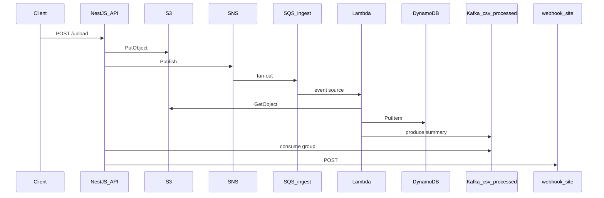

# Plano: Pipeline integrado com Kafka (substituir SQS processed)

## Objetivo

Unificar o experimento do spike com o fluxo real do projeto. Remover a segunda fila **`csv-processed-queue`** e usar **Apache Kafka KRaft** (já validado em [docs/KAFKA-SPIKE.md](docs/KAFKA-SPIKE.md)) para entregar o resumo `ProcessedSummary` da Lambda à API NestJS.

**Resultado esperado:** um único caminho de estudo — sem Lambda `csv-kafka-spike` nem tópico `csv.processed.test` no fluxo principal.

```text
Antes:  ... → Lambda → SQS csv-processed-queue → API (sqs-consumer) → webhook
Depois: ... → Lambda → Kafka csv.processed      → API (kafkajs)       → webhook
```

A fila **`csv-ingest-queue`** (SNS → Lambda) permanece inalterada.

---

## Arquitetura alvo



---

## 1. Infraestrutura local — Docker Compose + script único

Promover o Kafka do spike para o ambiente padrão do projeto.

| Ação | Detalhe |
|------|---------|
| Compose | [docker-compose.spike.yml](docker-compose.spike.yml) → **`docker-compose.yml`** (Kafka + Kafka UI; rede `study-net`) |
| Tópico | **`csv.processed`** (1 partição no estudo local) |
| Rede | Conectar `localstack-main` à `study-net` quando existir (modo attach) |

### Decisão: um script só para subir o ambiente (viável)

**Sim — dá para unificar com boa confiabilidade.** Kafka e LocalStack são passos independentes mas complementares; o spike já provou que `docker compose up` + healthcheck + criar tópico é idempotente, e o `bootstrap.sh` atual já é idempotente nos recursos AWS.

**Fluxo do usuário (caminho imperativo):**

```bash
# Pré-requisito: LocalStack em :4566 (ex.: container localstack-main)
bash scripts/bootstrap.sh          # Kafka + tópico + recursos AWS + snippet .env
cd api && npm run start:dev
curl -F "file=@arquivo.csv" http://localhost:3000/upload
```

**Implementação recomendada:**

- **[scripts/bootstrap.sh](scripts/bootstrap.sh)** ganha um **passo 0** antes do S3:
  1. `docker compose up -d kafka kafka-ui` (idempotente)
  2. Aguardar `csv-study-kafka` healthy (timeout + mensagem clara)
  3. Conectar `localstack-main` à `study-net` se existir
  4. Criar tópico `csv.processed` (`kafka-topics.sh --if-not-exists`)
  5. Verificar LocalStack (`curl :4566/_localstack/health`) — falhar cedo se LS não estiver up
  6. Seguir passos 1–9 atuais (S3, SNS, SQS ingest, …)

- **[scripts/lib/kafka-local.sh](scripts/lib/kafka-local.sh)** — funções `ensure_kafka_stack` e `ensure_kafka_topic` (sourced pelo bootstrap e pelo [scripts/deploy-cfn.sh](scripts/deploy-cfn.sh)), evita duplicar lógica entre os dois caminhos de provisionamento **sem** exigir um segundo comando do usuário.

- **Não criar** `kafka-up.sh` nem `kafka-create-topic.sh` como scripts obrigatórios no README. Opcional: `SKIP_KAFKA=1 bash scripts/bootstrap.sh` só para debug (pular passo 0).

- **[scripts/deploy-cfn.sh](scripts/deploy-cfn.sh)** chama `source scripts/lib/kafka-local.sh` + `ensure_kafka_*` no início — mesmo critério de “um comando por caminho”.

**Por que manter dois caminhos (bootstrap vs deploy-cfn)?** São alternativas de **provisionamento AWS** (imperativo vs CFN), não de Kafka. O Kafka é sempre preparado no início de cada um.

**Quando dois scripts separados fariam sentido:** se Kafka e LocalStack fossem reiniciados em ciclos muito diferentes no dia a dia; no seu estudo, subir tudo junto é o fluxo natural e reduz erro de “esqueci o kafka-up”.

---

## 2. Provisionamento LocalStack — remover SQS processed

### [scripts/bootstrap.sh](scripts/bootstrap.sh)

- Passo 0 Kafka (ver seção 1)
- Remover criação/uso de `PROCESSED_QUEUE` / `PROCESSED_URL`
- Manter apenas `csv-ingest-queue` no passo SQS
- Remover `sqs:SendMessage` na processed queue da IAM inline
- Lambda env: `KAFKA_BROKERS` + `KAFKA_TOPIC` (`host.docker.internal:19092`, `csv.processed`)
- Snippet `.env` da API: `KAFKA_BROKERS=localhost:19092`, `KAFKA_TOPIC=csv.processed`, `KAFKA_GROUP_ID=csv-processed-api` — remover `PROCESSED_QUEUE_URL`

### [scripts/destroy.sh](scripts/destroy.sh)

- Remover delete de `csv-processed-queue`

### [infrastructure/template.yaml](infrastructure/template.yaml)

- Remover recurso `ProcessedQueue`
- Remover `ProcessedQueueUrl` dos Outputs
- Remover `sqs:SendMessage` em `ProcessedQueue` da policy da Lambda
- Lambda `Environment`: `KAFKA_BROKERS`, `KAFKA_TOPIC` (valores fixos documentados para local, ex. `host.docker.internal:19092`)

### [scripts/deploy-cfn.sh](scripts/deploy-cfn.sh)

- Atualizar snippet `.env` com variáveis Kafka (sem `PROCESSED_QUEUE_URL`)

---

## 3. Lambda — producer Kafka

Arquivos: [lambda/src/handler.js](lambda/src/handler.js), [lambda/package.json](lambda/package.json)

- Adicionar dependência **`kafkajs`**
- Remover `@aws-sdk/client-sqs` e `SendMessageCommand` para fila processed
- Reutilizar lógica do producer em [spike/kafka-lambda/src/handler.js](spike/kafka-lambda/src/handler.js):
  - Mesmo JSON `ProcessedSummary` (`sourceKey`, `bucket`, `recordsCount`, `recordIds`, `processedAt`, `correlationId`)
  - Chave da mensagem: `correlationId`
  - Log `kafka_produced` (substituir `processed_queue_sent`)
- Env: `KAFKA_BROKERS`, `KAFKA_TOPIC` (sem `PROCESSED_QUEUE_URL`)
- Reempacotar zip (`npm run package` na pasta lambda)

---

## 4. API NestJS — consumer Kafka

### Novo consumer

Criar [api/src/consumer/processed-kafka.consumer.ts](api/src/consumer/processed-kafka.consumer.ts) com `kafkajs`:

- `KAFKA_BROKERS` default `localhost:19092` (API no host WSL)
- `KAFKA_TOPIC=csv.processed`
- `KAFKA_GROUP_ID=csv-processed-api`
- `eachMessage`: parse → `CloudWatchLoggerService` (`message_received`) → `WebhookService.notify`
- **Commit de offset somente após webhook OK** (equivalente ao delete SQS após sucesso)
- Em falha: não commitar (retry natural do consumer group)
- `OnModuleDestroy`: `consumer.disconnect()`

### Remover SQS processed

- Remover [api/src/consumer/processed-queue.consumer.ts](api/src/consumer/processed-queue.consumer.ts)
- [api/src/app.module.ts](api/src/app.module.ts): registrar `ProcessedKafkaConsumer`
- [api/package.json](api/package.json): adicionar `kafkajs`; remover `sqs-consumer` se não houver outro uso
- [api/src/aws/aws.config.ts](api/src/aws/aws.config.ts): trocar `processedQueueUrl` por `kafkaBrokers`, `kafkaTopic`, `kafkaGroupId`; remover `SQSClient` do `AwsClients` se ficar sem uso

### [api/.env.example](api/.env.example)

```env
KAFKA_BROKERS=localhost:19092
KAFKA_TOPIC=csv.processed
KAFKA_GROUP_ID=csv-processed-api
```

---

## 5. Limpeza do spike (fluxo único)

| Item | Ação |
|------|------|
| Lambda `csv-kafka-spike` | Remover do LocalStack (`delete-function`) e deixar de documentar no fluxo principal |
| `scripts/spike/*` | Remover ou arquivar após lógica ir para `scripts/lib/kafka-local.sh` + bootstrap |
| `spike/kafka-lambda/` | Opcional manter só como referência; não usado no E2E principal |
| [docs/KAFKA-SPIKE.md](docs/KAFKA-SPIKE.md) | Atualizar: spike concluído, comportamento integrado no pipeline; link para ARQUITETURA |

---

## 6. Documentação

Atualizar de forma consistente:

- [docs/ARQUITETURA.md](docs/ARQUITETURA.md) — diagrama, tabela de recursos, env vars, troubleshooting, decisões de design
- [README.md](README.md) — frase de arquitetura, pré-requisitos (Docker + Kafka), ordem de subida, tabela de serviços
- Remover referências a `csv-processed-queue` e `PROCESSED_QUEUE_URL` onde aparecerem

Troubleshooting novo:

| Sintoma | Causa provável | Ação |
|---------|----------------|------|
| Lambda não publica no Kafka | Kafka down ou `KAFKA_BROKERS` errado na Lambda | Rodar `bootstrap.sh` de novo (passo 0); verificar env da Lambda |
| API não consome | `KAFKA_BROKERS` vazio ou advertised listeners | `localhost:19092` no `.env` da API |
| Webhook OK mas offset não commita | Erro após notify | Ver logs `message_processing_failed` |

---

## 7. Teste E2E (critério de sucesso)

Executar sequência completa e registrar em `docs/ARQUITETURA.md` (seção curta “validação Kafka”):

```bash
bash scripts/destroy.sh && bash scripts/bootstrap.sh   # ou deploy-cfn (já sobe Kafka no início)
cd api && npm install && npm run start:dev
curl -F "file=@arquivo.csv" http://localhost:3000/upload
```

Validar:

1. Objeto no S3
2. Itens no DynamoDB (`awslocal dynamodb scan --table-name CsvRecords`)
3. Mensagem no tópico (`kafka-console-consumer` ou Kafka UI)
4. Logs API: `message_received`, `webhook_sent`
5. Logs Lambda: `kafka_produced`
6. **Sem** mensagens em `csv-processed-queue` (fila não deve mais existir após destroy + bootstrap novo)

---

## 8. Fora de escopo

- Separar worker Nest em processo/entrypoint próprio (consumer continua na API, como hoje)
- MSK real na AWS
- DLQ/retry topic Kafka
- Alterar fila ingest ou formato do CSV
- Testes unitários novos

---

## Ordem de implementação

1. `docker-compose.yml` + `scripts/lib/kafka-local.sh` + passo 0 no `bootstrap.sh` (e chamada no `deploy-cfn.sh`)
2. Lambda producer + package
3. API consumer Kafka + env/config
4. `destroy.sh`, `template.yaml`, ajustes finais nos scripts
5. Limpeza spike / outputs antigos
6. Docs + teste E2E documentado
