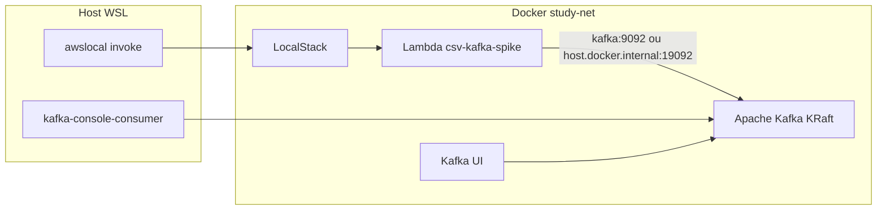

# Plano: Spike com Apache Kafka KRaft (substituir Redpanda)

## Objetivo

Trocar o broker **Redpanda** por **Apache Kafka oficial em modo KRaft** (sem ZooKeeper), mantendo o experimento Lambda LocalStack → tópico → validação. O foco é estudar **Kafka atual**: broker, listeners, tópicos, partições, consumer groups e **KRaft** (coordenação de metadados integrada ao próprio Kafka).

**Arquivo do plano (workspace):** [`.cursor/plans/spike_apache_kafka_aa735b1a.plan.md`](.cursor/plans/spike_apache_kafka_aa735b1a.plan.md)

**Fora de escopo:** migração do pipeline real (`csv-processed-queue`, [lambda/src/handler.js](lambda/src/handler.js), consumer Nest).

---

## O que empresas usam em produção (contexto para o estudo)

| Cenário | Padrão atual | ZooKeeper |
|---------|--------------|-----------|
| **Clusters novos (2024+)** | **KRaft** | Não — descontinuado no Kafka 4.x para novos deploys |
| **Cloud AWS** | **Amazon MSK** (modos com KRaft em versões recentes) | Operação abstraída; você só usa bootstrap brokers |
| **Brownfield legado** | Kafka + ZooKeeper | Ainda existe, mas em migração |

**Decisão deste plano:** **KRaft single-node** com imagem **`apache/kafka`** — alinhado ao padrão novo e ao que greenfield/MSK tendem a usar. A documentação menciona **ZK apenas como legado** (o que você pode encontrar em empresas antigas), sem subir ZK no compose.

---

## Estado atual vs alvo

| Aspecto | Hoje (Redpanda) | Alvo (Apache Kafka KRaft) |
|---------|-----------------|---------------------------|
| Imagem | `redpandadata/redpanda` | `apache/kafka` (3.8.x, 1 nó broker+controller) |
| Coordenação | embutida | **KRaft** (sem ZooKeeper) |
| CLI | `rpk` | `kafka-topics.sh`, `kafka-console-consumer.sh` |
| Hostname | `redpanda:9092` | `kafka:9092` |
| Container | `csv-study-redpanda` | `csv-study-kafka` |
| Cliente Lambda | `kafkajs` | `kafkajs` (inalterado) |

---

## Arquitetura alvo

Modos **attach** / **full** permanecem como em [docs/KAFKA-SPIKE.md](docs/KAFKA-SPIKE.md).

---

## 1. Docker Compose — Apache Kafka KRaft

Alterar [docker-compose.spike.yml](docker-compose.spike.yml):

- **Remover** serviço `redpanda` (e qualquer referência a ZooKeeper — não entra no spike).
- Adicionar serviço `kafka`:
  - Imagem: **`apache/kafka:3.8.x`** (fixar versão)
  - `container_name: csv-study-kafka`
  - KRaft single-node via env do image oficial:
    - `KAFKA_NODE_ID=1`
    - `KAFKA_PROCESS_ROLES=broker,controller`
    - `KAFKA_CONTROLLER_QUORUM_VOTERS=1@kafka:9093`
    - `KAFKA_LISTENERS`, `KAFKA_ADVERTISED_LISTENERS`, `KAFKA_LISTENER_SECURITY_PROTOCOL_MAP`, `KAFKA_CONTROLLER_LISTENER_NAMES`, `KAFKA_INTER_BROKER_LISTENER_NAME`
  - Listeners para estudo:
    - **INTERNAL** `kafka:9092` — rede `study-net` (modo full)
    - **EXTERNAL** `host.docker.internal:19092` — host WSL e Lambda attach
  - RAM: ~**1 GB** heap (mais leve que ZK+Kafka, mais pesado que Redpanda)
  - Healthcheck: `kafka-broker-api-versions.sh --bootstrap-server localhost:9092`
- **kafka-ui:** `KAFKA_CLUSTERS_0_BOOTSTRAPSERVERS: kafka:9092`, `depends_on: kafka` (healthy)
- **localstack:** profile `full` + `LAMBDA_DOCKER_NETWORK=study-net` inalterados

Comentários no compose explicando **KRaft** (broker + controller no mesmo processo em estudo single-node).

---

## 2. Scripts do spike — trocar `rpk` por CLI Kafka

| Script | Mudança |
|--------|---------|
| [scripts/spike/up.sh](scripts/spike/up.sh) | Subir `kafka` + `kafka-ui`; defaults `kafka:9092` (full) / `host.docker.internal:19092` (attach); checar `csv-study-kafka` |
| [scripts/spike/create-topic.sh](scripts/spike/create-topic.sh) | `docker exec csv-study-kafka ... kafka-topics.sh --bootstrap-server localhost:9092 --create ...` |
| [scripts/spike/run-spike-test.sh](scripts/spike/run-spike-test.sh) | `kafka-console-consumer.sh` + `timeout`; remover `csv-study-redpanda` / `rpk` |
| [scripts/spike/bootstrap-kafka-spike.sh](scripts/spike/bootstrap-kafka-spike.sh) | Comentários KRaft; defaults de brokers |
| [scripts/spike/down.sh](scripts/spike/down.sh) | Sem mudança estrutural |

---

## 3. Código da Lambda de spike

- [spike/kafka-lambda/src/handler.js](spike/kafka-lambda/src/handler.js): default `kafka:9092`; comentários **Apache Kafka (KRaft)**.
- `kafkajs` permanece — conecta só nos brokers `:9092`.

---

## 4. Consumidor opcional no host

- [spike/consume-test.mjs](spike/consume-test.mjs): opcional; mesma lição de **advertised listeners** do spike Redpanda.

---

## 5. Documentação ([docs/KAFKA-SPIKE.md](docs/KAFKA-SPIKE.md))

1. **KRaft no spike** — papéis `broker` + `controller`; por que não há ZooKeeper.
2. **Produção** — clusters novos e MSK em KRaft; ZK só como legado brownfield (nota curta).
3. Tabela de endpoints (`kafka:9092`, `localhost:19092`, controller `:9093` interno).
4. CLI: `kafka-topics`, `kafka-console-consumer`, `kafka-consumer-groups`.
5. Resultados do reteste E2E.

Atualizar [README.md](README.md) e [docs/ARQUITETURA.md](docs/ARQUITETURA.md).

**Não editar** [kafka_localstack_spike_8f6887bc.plan.md](kafka_localstack_spike_8f6887bc.plan.md).

---

## 6. Critérios de sucesso

- Compose sobe **Apache Kafka KRaft** + Kafka UI (sem ZooKeeper).
- Spike E2E: Lambda publica → `kafka-console-consumer` confirma `correlationId`.
- Docs descrevem KRaft como padrão atual e MSK como equivalente gerenciado na AWS.
- Zero `rpk` / Redpanda nos scripts.

---

## 7. Riscos e mitigação

| Risco | Mitigação |
|-------|-----------|
| Kafka lento/OOM no WSL | Heap ~1G; single broker KRaft |
| Advertised listeners | INTERNAL/EXTERNAL como no spike Redpanda |
| LocalStack sem `LAMBDA_DOCKER_NETWORK` | `host.docker.internal:19092` no modo attach |

---

## Ordem de implementação

1. Compose Kafka KRaft + healthcheck + Kafka UI
2. Scripts `up`, `create-topic`, `run-spike-test`
3. Lambda spike (defaults/comentários)
4. Teste E2E attach e/ou full
5. `docs/KAFKA-SPIKE.md` (KRaft + MSK + nota ZK legado)
