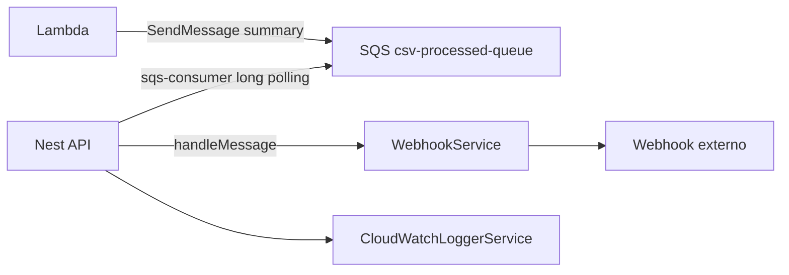

---
todos:
  - id: add-sqs-consumer
    content: Adicionar `sqs-consumer` às dependências da API.
    status: pending
  - id: refactor-consumer
    content: Refatorar `ProcessedQueueConsumer` para usar `Consumer.create` no lugar do polling manual.
    status: pending
  - id: wire-events
    content: Mapear eventos de erro/parada da lib para `Logger` e `CloudWatchLoggerService` quando fizer sentido.
    status: pending
  - id: graceful-shutdown
    content: Garantir parada do consumer no `onModuleDestroy` e habilitar shutdown hooks no bootstrap da API.
    status: pending
  - id: validate-build
    content: Executar build da API e ajustar erros de tipo ou import.
    status: pending
  - id: validate-flow
    content: Testar o fluxo existente para confirmar que upload, Lambda, SQS processed e webhook continuam funcionando.
    status: pending
  - id: review-docs
    content: Revisar `docs/` para identificar e aplicar ajustes necessários sobre o novo consumer SQS.
    status: pending
---

# Plano: Profissionalizar Consumer SQS

## Objetivo

Substituir o loop manual em [`api/src/consumer/processed-queue.consumer.ts`](../../api/src/consumer/processed-queue.consumer.ts) por `sqs-consumer`, mantendo o consumer dentro da API Nest atual e preservando o comportamento existente: ler mensagem da `PROCESSED_QUEUE_URL`, notificar webhook, deletar da fila somente em caso de sucesso e deixar a mensagem voltar para retry em caso de erro.

## Fluxo Alvo



## Mudanças Planejadas

1. Adicionar a dependência `sqs-consumer` em [`api/package.json`](../../api/package.json), usando a versão atual compatível com AWS SDK v3.

2. Refatorar [`api/src/consumer/processed-queue.consumer.ts`](../../api/src/consumer/processed-queue.consumer.ts):
   - Remover `ReceiveMessageCommand`, `DeleteMessageCommand`, `running`, `pollLoop`, `pollOnce` e `sleep`.
   - Criar uma instância de `Consumer` no `onModuleInit()`.
   - Passar o `SQSClient` já existente via `sqs: this.aws.sqs`, preservando a configuração LocalStack/AWS de [`api/src/aws/aws.config.ts`](../../api/src/aws/aws.config.ts).
   - Configurar `queueUrl`, `waitTimeSeconds`, `visibilityTimeout`, `batchSize` e `handleMessageTimeout`.
   - Usar `handleMessage` para reaproveitar a lógica atual de parse, log e `webhookService.notify(summary)`.

3. Preservar a semântica de retry atual:
   - Se `handleMessage` terminar sem erro, o `sqs-consumer` confirma a mensagem e a remove da fila.
   - Se `handleMessage` lançar erro, a mensagem não é deletada e volta depois do `VisibilityTimeout`.
   - Isso mantém o comportamento que hoje é feito manualmente com `DeleteMessageCommand`.

4. Melhorar observabilidade do consumer:
   - Registrar eventos da lib como `error`, `processing_error`, `timeout_error`, `stopped` e, se útil, `message_received` apenas nos logs internos.
   - Manter os logs estruturados existentes em `CloudWatchLoggerService` para `message_received` e `message_processing_failed`.

5. Melhorar shutdown:
   - Guardar a instância do `Consumer` em uma propriedade privada.
   - No `onModuleDestroy()`, chamar `consumer.stop()`.
   - Planejar também habilitar `app.enableShutdownHooks()` em [`api/src/main.ts`](../../api/src/main.ts), porque isso permite ao Nest chamar hooks de destroy corretamente quando o processo recebe sinais como `SIGTERM`.

6. Validar build:
   - Rodar `npm install sqs-consumer` dentro de [`api`](../../api).
   - Rodar `npm run build` dentro de [`api`](../../api).
   - Corrigir eventuais erros de tipo/import causados pela API da lib.

7. Testar o fluxo existente:
   - Subir a estrutura local conforme os scripts atuais do projeto.
   - Executar um upload CSV pelo endpoint da API.
   - Confirmar que a Lambda continua gravando no DynamoDB e publicando o resumo na fila processada.
   - Confirmar que o consumer com `sqs-consumer` recebe a mensagem, chama o webhook e remove a mensagem da fila após sucesso.
   - Verificar logs da API e da Lambda para garantir que não houve regressão no fluxo.

8. Revisar a documentação existente:
   - Ler os arquivos relevantes em [`docs`](../../docs).
   - Atualizar somente o que ficar desatualizado pela troca do polling manual para `sqs-consumer`.
   - Manter a documentação no mesmo nível atual, sem criar documentação extensa nova.

## Configuração Inicial Recomendada

Começar conservador, próximo ao comportamento atual:

```ts
Consumer.create({
  queueUrl,
  sqs: this.aws.sqs,
  batchSize: 1,
  waitTimeSeconds: 20,
  visibilityTimeout: 60,
  handleMessageTimeout: 55_000,
  handleMessage: async (message) => {
    // parse summary, log, notify webhook
  },
});
```

`batchSize: 1` mantém o processamento sequencial atual. Em produção, depois de validar idempotência e capacidade do webhook, poderia evoluir para `batchSize` maior, até o limite de 10 mensagens por chamada SQS.

## Fora de Escopo Neste Passo

- Criar worker separado.
- Criar DLQ/redrive policy.
- Criar novas funcionalidades.
- Criar testes unitários.
- Criar documentação extensa nova.
- Alterar o fluxo da Lambda ou o formato da mensagem.
