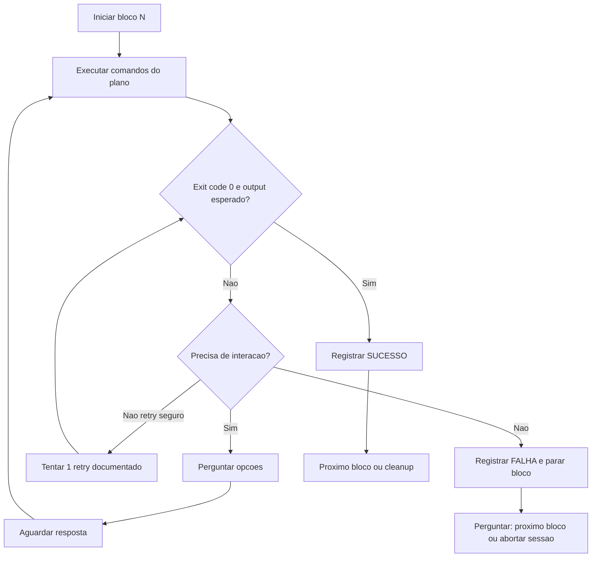

# Plano: testar CLI dos serviços no LocalStack

## Objetivo

Validar **comandos `awslocal`** para os serviços AWS usados em estudos locais: criar recursos, exercitar operações típicas e limpar tudo ao final. Nomes de recursos usam prefixo **`cli-test-`** para facilitar o destroy.

`awslocal sts get-caller-identity` deve responder sem erro antes de começar.

---

## Regras de execução

Duas regras transversais valem **em todos os blocos (prep + 1–8 + cleanup)**:

### 1. Perguntar antes de seguir

**Parar e perguntar** (não improvisar nem pular silenciosamente) quando:

| Situação | Ação antes de continuar |
|----------|-------------------------|
| `awslocal sts get-caller-identity` ou health falha | Perguntar se LocalStack está rodando, se precisa `LOCALSTACK_AUTH_TOKEN`, ou se prefere abortar |
| Serviço aparece `"available": false` no health | Perguntar se segue só com serviços disponíveis ou espera correção do container |
| Comando falha e há **mais de um caminho** (retry, workaround, pular bloco, abortar) | Apresentar opções curtas e **aguardar escolha** |
| Placeholder que exige valor seu (ex.: `webhook.site/SEU-UUID` em Secrets Manager) | Perguntar URL/token ou se usa valor fictício só para teste de CLI |
| SNS→SQS: `receive-message` vazio após publish | Perguntar se tenta ajustar policy da fila, reexecuta subscribe, ou registra falha e segue |
| Lambda: runtime `nodejs18.x` indisponível no LocalStack | Perguntar runtime alternativo (`nodejs20.x`, etc.) |
| CloudFormation `deploy` falha | Perguntar se tenta template simplificado, inspeciona eventos da stack, ou registra falha e segue |
| Cleanup encontra recurso órfão ou delete falha | Perguntar se força delete, ignora com anotação, ou para para inspecionar |
| Passo exige editar arquivo fora do escopo, reiniciar Docker, ou instalar pacote | Perguntar explicitamente |

**Pode seguir automaticamente** (sem pergunta):

- Export de credenciais `test` / região `us-east-1`
- Comandos copy-paste do plano que retornam sucesso na primeira tentativa
- Registrar resultado (sucesso ou falha) em `docs/CLI-LOCALSTACK.md`
- Destroy de recursos `cli-test-*` quando os deletes funcionam



### 2. Documentar sucessos e falhas

Criar/atualizar [`docs/CLI-LOCALSTACK.md`](docs/CLI-LOCALSTACK.md) **durante** a execução (não só no final).

Estrutura proposta:

```markdown
# CLI LocalStack — resultados dos testes

## Metadados da sessão
- Data, versão LocalStack (health), região, ambiente (WSL/Docker)

## Sumário
| Bloco | Status | Observação |
| S3 | OK / FALHA / PULADO | ... |

## Sucessos
### N. Nome do serviço
- Comando exato que funcionou
- Output relevante (truncado)
- Ajuste local vs plano original (se houver)

## Falhas e investigação
### N. Nome do serviço
- Comando que falhou
- Exit code
- stderr / mensagem de erro completa
- Contexto (variáveis, ordem dos passos, dependências)
- Tentativas já feitas
- Hipótese / próximo passo sugerido
- Bloqueante? (sim/não)

## Divergências LocalStack vs AWS real
- IAM, SNS policy, CFN, etc.

## Cleanup
- Recursos removidos / pendentes
```

**Critérios de registro:**

- **Sucesso:** comando + output mínimo que prova o comportamento (ARN, `StackStatus`, corpo da mensagem SQS, etc.).
- **Falha:** comando + erro integral + o que já foi tentado; se um retry posterior funcionar, mover retry para Sucessos e **manter** a falha em Falhas com nota "resolvido em retry X".
- **Pulado:** registrar motivo e se foi por escolha após pergunta.

---

## Ambiente (sempre no início da sessão)

```bash
export AWS_ACCESS_KEY_ID=test
export AWS_SECRET_ACCESS_KEY=test
export AWS_DEFAULT_REGION=us-east-1

# Sanity check
awslocal sts get-caller-identity
curl -s http://127.0.0.1:4566/_localstack/health | grep -E '"s3"|"sns"|"sqs"|"lambda"|"dynamodb"|"secretsmanager"|"iam"|"logs"|"cloudformation"'
```

Região fixa **`us-east-1`** evita mismatch de ARN entre SQS e Lambda no LocalStack.

Se prep falhar → **parar e perguntar** antes de continuar (ver Regras de execução).

---

## 1. S3

Comandos: `s3 mb`, `s3 cp`, `s3 ls`, `s3 rm`, `s3 rb`.

```bash
BUCKET=cli-test-uploads

awslocal s3 mb "s3://${BUCKET}"
echo "nome,data,valor" > /tmp/cli-test.csv
echo "Alice,2026-06-02,10.5" >> /tmp/cli-test.csv

awslocal s3 cp /tmp/cli-test.csv "s3://${BUCKET}/uploads/cli-test.csv"
awslocal s3 ls "s3://${BUCKET}/uploads/"
awslocal s3api head-object --bucket "${BUCKET}" --key uploads/cli-test.csv
```

**Destroy:**

```bash
awslocal s3 rm "s3://${BUCKET}" --recursive
awslocal s3 rb "s3://${BUCKET}"
```

**Nota LocalStack free:** path-style funciona via `awslocal`; em SDKs use `forcePathStyle: true` se necessário.

**Documentar:** sucesso ou falha de cada operação em `docs/CLI-LOCALSTACK.md`.

---

## 2. SNS + SQS

Comandos: `sns create-topic`, `sqs create-queue`, `sns subscribe`, `sns publish`, `sqs receive-message`.

```bash
TOPIC_ARN=$(awslocal sns create-topic --name cli-test-events --output text)
echo "Topic: ${TOPIC_ARN}"

INGEST_URL=$(awslocal sqs create-queue --queue-name cli-test-ingest-queue --output text)
PROCESSED_URL=$(awslocal sqs create-queue --queue-name cli-test-processed-queue --output text)
echo "Ingest: ${INGEST_URL}"
echo "Processed: ${PROCESSED_URL}"

# Extrair ARN da fila ingest (LocalStack costuma aceitar QueueUrl no subscribe)
INGEST_ARN=$(awslocal sqs get-queue-attributes \
  --queue-url "${INGEST_URL}" \
  --attribute-names QueueArn \
  --query 'Attributes.QueueArn' --output text)

awslocal sns subscribe \
  --topic-arn "${TOPIC_ARN}" \
  --protocol sqs \
  --notification-endpoint "${INGEST_ARN}" \
  --attributes RawMessageDelivery=true

awslocal sns publish \
  --topic-arn "${TOPIC_ARN}" \
  --message '{"bucket":"cli-test-uploads","key":"uploads/cli-test.csv"}'

awslocal sqs receive-message --queue-url "${INGEST_URL}" --max-number-of-messages 1 --wait-time-seconds 5
```

**Destroy:**

```bash
awslocal sqs delete-queue --queue-url "${INGEST_URL}"
awslocal sqs delete-queue --queue-url "${PROCESSED_URL}"
awslocal sns delete-topic --topic-arn "${TOPIC_ARN}"
```

**Limite Hobby:** subscription SNS→SQS funciona; se `receive-message` vier vazio → **parar e perguntar** (ajustar policy, reexecutar subscribe, ou registrar falha). Ver [doc SNS-SQS LocalStack](https://docs.localstack.cloud/user-guide/aws/sns/).

---

## 3. DynamoDB

Comandos: `dynamodb create-table`, `put-item`, `scan`.

```bash
awslocal dynamodb create-table \
  --table-name cli-test-records \
  --attribute-definitions AttributeName=id,AttributeType=S \
  --key-schema AttributeName=id,KeyType=HASH \
  --billing-mode PAY_PER_REQUEST

awslocal dynamodb put-item \
  --table-name cli-test-records \
  --item '{"id":{"S":"rec-1"},"nome":{"S":"Alice"},"data":{"S":"2026-06-02"},"valor":{"S":"10.5"},"sourceKey":{"S":"uploads/cli-test.csv"}}'

awslocal dynamodb scan --table-name cli-test-records
```

**Destroy:**

```bash
awslocal dynamodb delete-table --table-name cli-test-records
```

---

## 4. Secrets Manager

Comandos: `secretsmanager create-secret`, `get-secret-value`.

**Antes de executar:** perguntar URL/token do webhook ou confirmar uso de valor fictício.

```bash
SECRET_ARN=$(awslocal secretsmanager create-secret \
  --name cli-test/webhook \
  --secret-string '{"token":"token-estudo","webhookUrl":"https://webhook.site/SEU-UUID"}' \
  --query ARN --output text)

awslocal secretsmanager get-secret-value --secret-id cli-test/webhook
```

**Destroy:**

```bash
awslocal secretsmanager delete-secret --secret-id cli-test/webhook --force-delete-without-recovery
```

---

## 5. IAM (role para Lambda)

Comandos: `iam create-role`, `iam put-role-policy`. No LocalStack free a **enforcement** de IAM é fraca; o foco é aprender o formato dos comandos.

```bash
awslocal iam create-role \
  --role-name cli-test-lambda-role \
  --assume-role-policy-document '{
    "Version": "2012-10-17",
    "Statement": [{
      "Effect": "Allow",
      "Principal": {"Service": "lambda.amazonaws.com"},
      "Action": "sts:AssumeRole"
    }]
  }'

awslocal iam put-role-policy \
  --role-name cli-test-lambda-role \
  --policy-name cli-test-lambda-policy \
  --policy-document '{
    "Version": "2012-10-17",
    "Statement": [{
      "Effect": "Allow",
      "Action": ["s3:GetObject","dynamodb:PutItem","sqs:SendMessage","logs:*"],
      "Resource": "*"
    }]
  }'

ROLE_ARN=$(awslocal iam get-role --role-name cli-test-lambda-role --query 'Role.Arn' --output text)
echo "Role ARN: ${ROLE_ARN}"
```

**Destroy:**

```bash
awslocal iam delete-role-policy --role-name cli-test-lambda-role --policy-name cli-test-lambda-policy
awslocal iam delete-role --role-name cli-test-lambda-role
```

---

## 6. CloudWatch Logs

Comandos: `logs create-log-group`, `put-log-events`, `filter-log-events` (e `tail` se disponível na sua versão do CLI).

```bash
LOG_GROUP=/cli-test/pipeline

awslocal logs create-log-group --log-group-name "${LOG_GROUP}"

awslocal logs put-log-events \
  --log-group-name "${LOG_GROUP}" \
  --log-stream-name stream-1 \
  --log-events timestamp=$(($(date +%s)*1000)),message='{"event":"cli_test","ok":true}'

awslocal logs filter-log-events --log-group-name "${LOG_GROUP}"
# Se suportado:
awslocal logs tail "${LOG_GROUP}" --since 1h
```

**Destroy:**

```bash
awslocal logs delete-log-group --log-group-name "${LOG_GROUP}"
```

Lambdas também geram grupo automático `/aws/lambda/<function-name>` após a primeira execução.

---

## 7. Lambda

Empacotar handler mínimo, `create-function`, `invoke` e, se quiser, `create-event-source-mapping` com a fila SQS.

```bash
mkdir -p /tmp/cli-test-lambda && cd /tmp/cli-test-lambda
cat > index.js <<'EOF'
exports.handler = async (event) => {
  console.log('cli-test-lambda event', JSON.stringify(event));
  return { statusCode: 200, body: 'ok' };
};
EOF
zip -q function.zip index.js

ROLE_ARN=$(awslocal iam get-role --role-name cli-test-lambda-role --query 'Role.Arn' --output text 2>/dev/null || true)
# Se a role foi apagada, recriar seção IAM acima antes deste passo

awslocal lambda create-function \
  --function-name cli-test-processor \
  --runtime nodejs18.x \
  --role "${ROLE_ARN}" \
  --handler index.handler \
  --zip-file fileb://function.zip \
  --environment "Variables={AWS_REGION=us-east-1}"

awslocal lambda invoke --function-name cli-test-processor \
  --payload '{"test":true}' /tmp/lambda-out.json
cat /tmp/lambda-out.json
```

**Event source mapping (SQS → Lambda)** — opcional:

```bash
# Requer fila ingest e função existentes
awslocal lambda create-event-source-mapping \
  --function-name cli-test-processor \
  --event-source-arn "${INGEST_ARN}" \
  --batch-size 1
```

**Destroy:**

```bash
awslocal lambda delete-function --function-name cli-test-processor
```

**Rede:** do host WSL use `127.0.0.1:4566`; Lambdas rodando **dentro** do Docker do LocalStack costumam usar `http://localstack-main:4566` (nome do container).

Se runtime falhar → **parar e perguntar** runtime alternativo antes de continuar.

---

## 8. CloudFormation

Comandos: `cloudformation deploy`, `describe-stacks`, `delete-stack`. Template **mínimo**:

Salvar como `/tmp/cli-test-stack.yaml`:

```yaml
AWSTemplateFormatVersion: '2010-09-09'
Description: CLI test stack for LocalStack free

Resources:
  TestBucket:
    Type: AWS::S3::Bucket
    Properties:
      BucketName: cli-test-cfn-bucket

Outputs:
  BucketName:
    Value: !Ref TestBucket
```

```bash
awslocal cloudformation deploy \
  --stack-name cli-test-stack \
  --template-file /tmp/cli-test-stack.yaml \
  --no-fail-on-empty-changeset

awslocal cloudformation describe-stacks --stack-name cli-test-stack \
  --query 'Stacks[0].StackStatus'

awslocal cloudformation describe-stacks --stack-name cli-test-stack \
  --query 'Stacks[0].Outputs'
```

**Destroy:**

```bash
awslocal cloudformation delete-stack --stack-name cli-test-stack
awslocal cloudformation wait stack-delete-complete --stack-name cli-test-stack
```

**Limite Hobby:** sem nested stacks / SAM; template YAML simples. Se `deploy` falhar → **parar e perguntar** próximo passo; registrar recurso, mensagem de erro e tentativas em `docs/CLI-LOCALSTACK.md` (seção Falhas).

**CFN com código Lambda (padrão híbrido):** zip no S3 + parâmetros `LambdaS3Bucket` / `LambdaS3Key` no template — útil quando o handler não fica inline no YAML.

---

## Resumo dos comandos

| Serviço | Comandos exercitados |
|---------|----------------------|
| S3 | `mb`, `cp`, `ls`, `rm`, `rb`, `head-object` |
| SNS | `create-topic`, `publish`, `subscribe`, `delete-topic` |
| SQS | `create-queue`, `receive-message`, `get-queue-attributes`, `delete-queue` |
| DynamoDB | `create-table`, `put-item`, `scan`, `delete-table` |
| Secrets Manager | `create-secret`, `get-secret-value`, `delete-secret` |
| IAM | `create-role`, `put-role-policy`, `get-role`, `delete-role` |
| Logs | `create-log-group`, `put-log-events`, `filter-log-events`, `delete-log-group` |
| Lambda | `create-function`, `invoke`, `create-event-source-mapping`, `delete-function` |
| CloudFormation | `deploy`, `describe-stacks`, `delete-stack`, `wait` |

---

## Checklist de conclusão

- [x] Prep executado; health documentado (serviços available/unavailable)
- [x] Cada bloco 1–8 com entrada em **Sucessos**, **Falhas** ou **Pulado (motivo)** em `docs/CLI-LOCALSTACK.md`
- [x] Nenhum passo que exigia interação foi feito sem confirmação prévia (Secrets: URL fictícia documentada)
- [x] Recursos `cli-test-*` removidos ou listados como pendentes na seção Cleanup do doc
- [x] Sumário e divergências LocalStack vs AWS real (IAM enforcement, SNS policy, CFN) preenchidos
