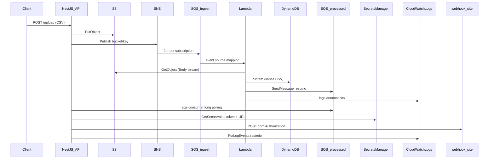

# Arquitetura — Pipeline CSV LocalStack

Documentação do fluxo de aplicação após testes end-to-end bem-sucedidos (bootstrap e CloudFormation).

Para referência de comandos `awslocal` e comportamento dos serviços locais, veja [`CLI-LOCALSTACK.md`](CLI-LOCALSTACK.md).

---

## Diagrama do fluxo



---

## Bootstrap vs CloudFormation

| Aspecto | `scripts/bootstrap.sh` | `scripts/deploy-cfn.sh` |
|---------|------------------------|-------------------------|
| Estilo | Imperativo (CLI passo a passo) | Declarativo (template YAML) |
| Ideal para | Entender cada serviço isoladamente | IaC, reprodutibilidade, updates |
| Lambda | Zip local → `create-function` | Zip no S3 → `AWS::Lambda::Function` |
| Idempotência | Script ignora recursos existentes | CFN faz create/update da stack |
| Destroy | `scripts/destroy.sh` | `scripts/destroy-cfn.sh` |
| Stack name | — | `csv-pipeline-study` |

**Regra:** use apenas um método por ciclo de teste (mesmos nomes fixos de recursos).

---

## Tabela de recursos AWS locais

| Serviço | Nome / ID | ARN / URL (padrão us-east-1) |
|---------|-----------|------------------------------|
| S3 | `csv-uploads` | `arn:aws:s3:::csv-uploads` |
| S3 (artefatos CFN) | `csv-cfn-artifacts` | zip da Lambda |
| SNS | `csv-upload-events` | `arn:aws:sns:us-east-1:000000000000:csv-upload-events` |
| SQS ingest | `csv-ingest-queue` | URL impressa no bootstrap/outputs CFN |
| SQS processed | `csv-processed-queue` | URL impressa no bootstrap/outputs CFN |
| DynamoDB | `CsvRecords` | PK: `id` (String) |
| Lambda | `csv-processor` | runtime `nodejs18.x`, handler `handler.handler` |
| IAM Role | `csv-processor-lambda-role` | trust: `lambda.amazonaws.com` |
| Secret | `study/webhook` | JSON `{ token, webhookUrl }` |
| Logs API | `/study/csv-pipeline` | API escreve eventos estruturados |
| Logs Lambda | `/aws/lambda/csv-processor` | automático pelo runtime Lambda |
| CFN Stack | `csv-pipeline-study` | status esperado: `CREATE_COMPLETE` |

### Outputs CloudFormation

| OutputKey | Descrição |
|-----------|-----------|
| `BucketName` | Bucket S3 de uploads |
| `SnsTopicArn` | ARN do tópico SNS |
| `IngestQueueUrl` | Fila ingest → Lambda |
| `ProcessedQueueUrl` | Fila processada → API |
| `DynamoTableName` | Nome da tabela |
| `SecretArn` | ARN do secret webhook |
| `LogGroupName` | Log group da API |

---

## Variáveis de ambiente (API)

Arquivo: `api/.env` (copiar de `api/.env.example`).

| Variável | Descrição | Exemplo |
|----------|-----------|---------|
| `AWS_ENDPOINT_URL` | LocalStack no host WSL | `http://127.0.0.1:4566` |
| `AWS_REGION` | Região fixa | `us-east-1` |
| `AWS_ACCESS_KEY_ID` | Credencial LocalStack | `test` |
| `AWS_SECRET_ACCESS_KEY` | Credencial LocalStack | `test` |
| `S3_BUCKET` | Bucket de uploads | `csv-uploads` |
| `SNS_TOPIC_ARN` | Tópico publicado após upload | ARN do bootstrap/CFN |
| `PROCESSED_QUEUE_URL` | Fila consumida em background | URL SQS |
| `DYNAMODB_TABLE` | Tabela (referência) | `CsvRecords` |
| `SECRET_NAME` | Secret do webhook | `study/webhook` |
| `LOG_GROUP_NAME` | CloudWatch da API | `/study/csv-pipeline` |
| `PORT` | Porta HTTP | `3000` |

### Variáveis da Lambda (configuradas no bootstrap/CFN)

| Variável | Valor típico (Docker) |
|----------|----------------------|
| `AWS_ENDPOINT_URL` | `http://localhost.localstack.cloud:4566` |
| `DYNAMODB_TABLE` | `CsvRecords` |
| `PROCESSED_QUEUE_URL` | URL da fila processed |
| `AWS_REGION` | `us-east-1` |

---

## Formato do CSV

Arquivo modelo: `arquivo.csv`

```csv
nome,data,valor
produto A,2026-05-20,12000
produto B,2026-05-21,15000
```

Cada linha de dados vira um item DynamoDB:

```json
{
  "id": "<uuid>",
  "nome": "produto A",
  "data": "2026-05-20",
  "valor": "12000",
  "sourceKey": "uploads/1234567890-arquivo.csv",
  "uploadedAt": "2026-06-02T19:12:01.270Z"
}
```

A Lambda lê o `Body` retornado pelo `GetObjectCommand` como stream e faz o parsing com `csv-parse`.
Essa abordagem evita carregar o arquivo inteiro em memória e mantém o exemplo mais próximo de um fluxo usado em produção.
O código também mantém uma versão sync do parser apenas como referência didática para arquivos pequenos.

---

## Eventos CloudWatch (API)

| event | Quando |
|-------|--------|
| `upload_started` | Início do POST /upload |
| `sns_published` | Após Publish no SNS |
| `webhook_sent` | POST webhook.site OK |
| `webhook_failed` | Falha no webhook (URL placeholder, rede, etc.) |
| `message_received` | Consumer recebeu resumo da fila processada |
| `message_processing_failed` | Falha no handler do consumer (webhook, parse, etc.) |

Consulta:

```bash
awslocal logs tail /study/csv-pipeline --since 1h
awslocal logs tail /aws/lambda/csv-processor --since 1h
```

---

## Comandos de teste do pipeline

```bash
# 1. Provisionar (escolha um)
bash scripts/bootstrap.sh
# ou
bash scripts/deploy-cfn.sh

# 2. API
cd api && npm run start:dev

# 3. Upload
curl -F "file=@arquivo.csv" http://localhost:3000/upload

# 4. Validar
awslocal s3 ls s3://csv-uploads/uploads/
awslocal dynamodb scan --table-name CsvRecords
awslocal logs tail /aws/lambda/csv-processor --since 10m
awslocal logs tail /study/csv-pipeline --since 10m
```

### Troubleshooting de aplicação

| Sintoma | Causa provável | Ação |
|---------|----------------|------|
| DynamoDB vazio após upload | Lambda não alcança LocalStack | Ajustar `AWS_ENDPOINT_URL` da Lambda para `localhost.localstack.cloud:4566` ou IP do container |
| `webhook_failed` 404 | URL placeholder `SEU-UUID` | Atualizar secret `study/webhook` com URL real |
| Consumer não recebe mensagens | `PROCESSED_QUEUE_URL` vazia no `.env` | Copiar URL dos outputs do bootstrap/CFN |
| CFN falha em IAM | Capability não passada | `deploy-cfn.sh` já usa `--capabilities CAPABILITY_NAMED_IAM` |

Para erros de CLI genéricos (SQS URLs, Lambda Pending, put-log-events), ver [`CLI-LOCALSTACK.md`](CLI-LOCALSTACK.md).

---

## Limitações LocalStack Hobby vs AWS real

| Área | LocalStack (estudo) | AWS produção |
|------|---------------------|--------------|
| IAM | Enforcement fraca | Políticas efetivas no runtime |
| Persistência | Recursos somem ao reiniciar container | Persistente por padrão |
| S3 Event Notification | Não usamos (SNS explícito da API) | Alternativa comum em produção |
| SNS→SQS | Funcionou com policy na fila | Mesmo padrão recomendado |
| CloudFormation | Template simples OK | SAM/CDK, nested stacks, etc. |
| Secrets Manager | Sem rotação/KMS real | KMS, rotação automática |
| Lambda rede | Endpoint Docker específico | VPC, ENI, security groups |
| CloudWatch | Logs básicos | Métricas, alarms, Insights |

---

## Decisões de design (didáticas)

1. **SNS explícito em vez de S3 Event Notification** — mais estável no LocalStack; mesmo aprendizado de mensageria pub/sub.
2. **RawMessageDelivery no SNS→SQS** — body da fila = JSON direto (`bucket`, `key`), sem envelope SNS.
3. **Lambda fora do template inline** — zip empacotado separadamente (`npm run package`); padrão híbrido comum em projetos reais.
4. **Webhook só na API** — Lambda não precisa de internet; reduz falhas de rede no Docker.
5. **Dois caminhos de provisionamento** — comparar imperativo vs declarativo no mesmo conjunto de recursos.
6. **CSV via stream com `csv-parse`** — parser mais robusto que `split`, com validação explícita do header e menor uso de memória em arquivos maiores.
7. **Consumer SQS com `sqs-consumer`** — biblioteca recomendada para Node (BBC); encapsula long polling, delete após sucesso e retry via `visibilityTimeout`, em vez de loop manual com `ReceiveMessage`/`DeleteMessage`.
